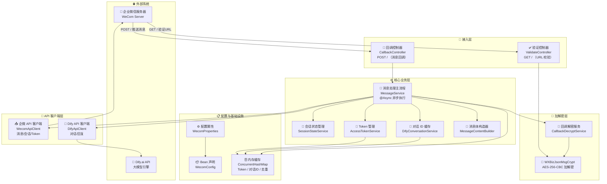
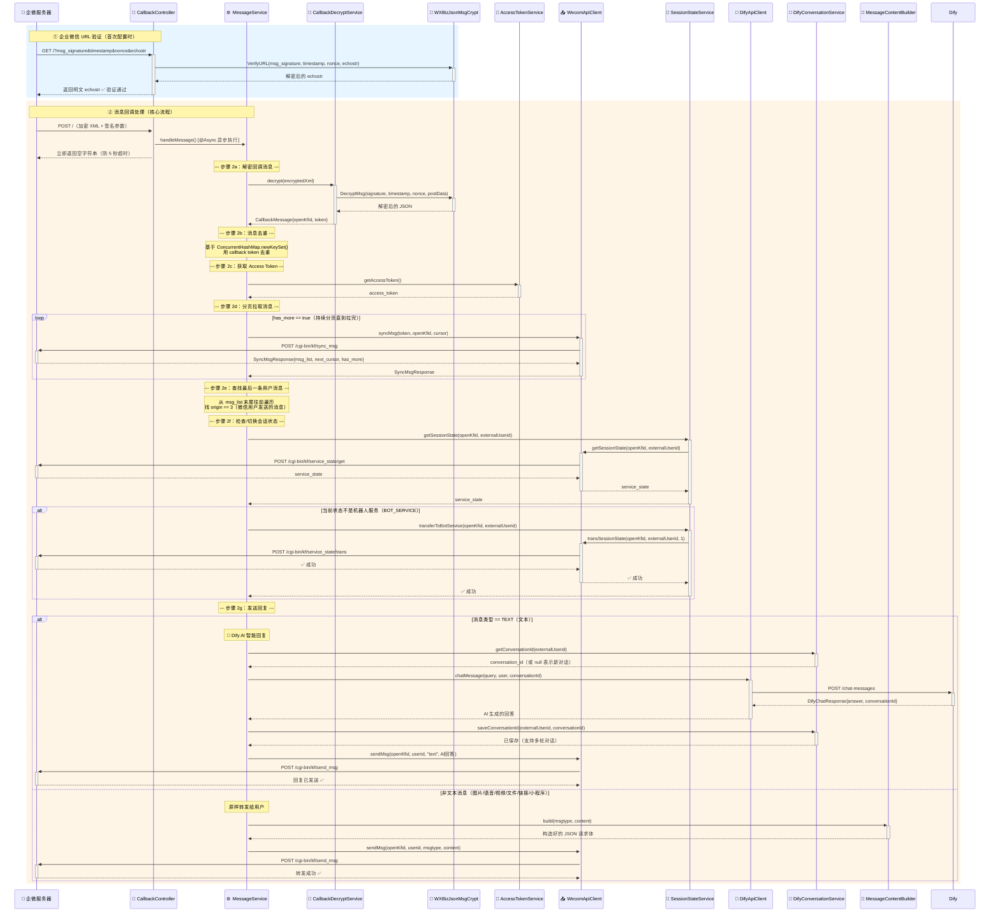
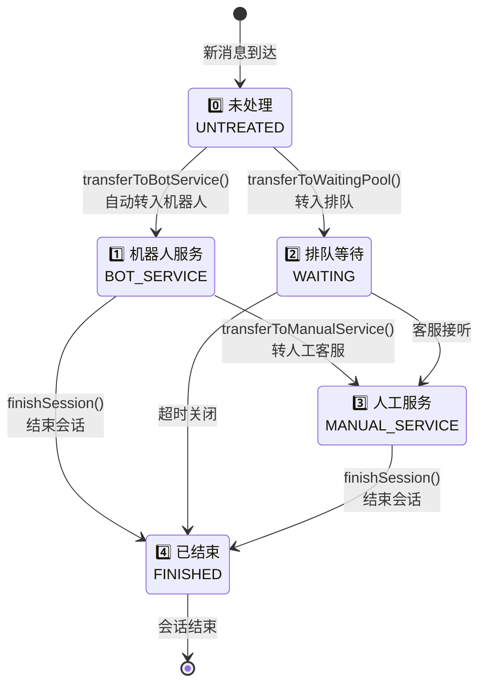
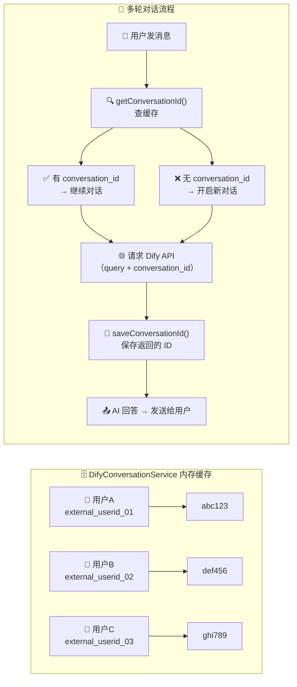
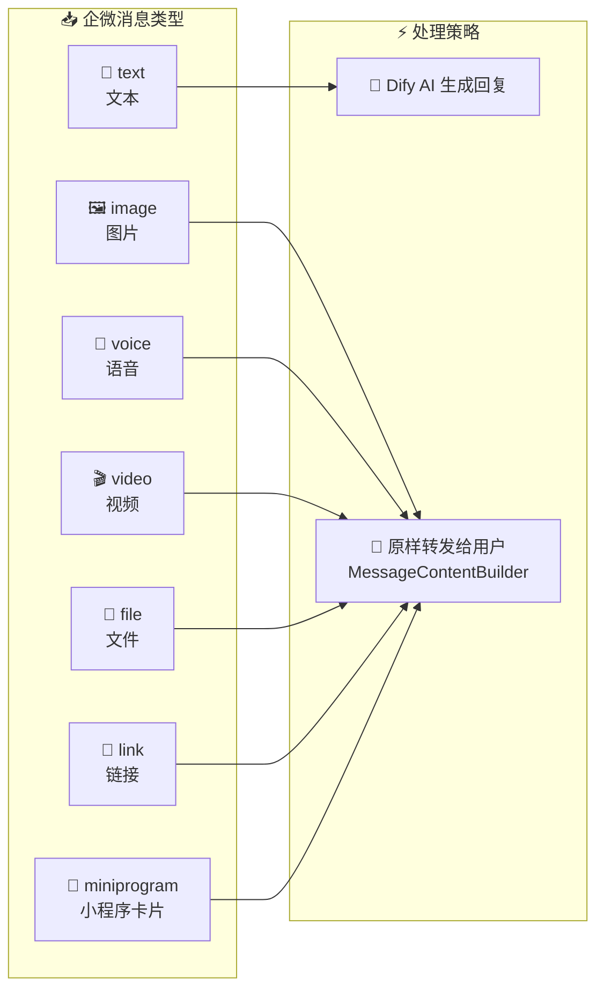
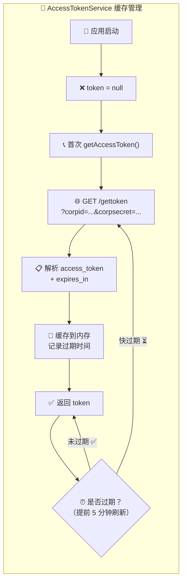
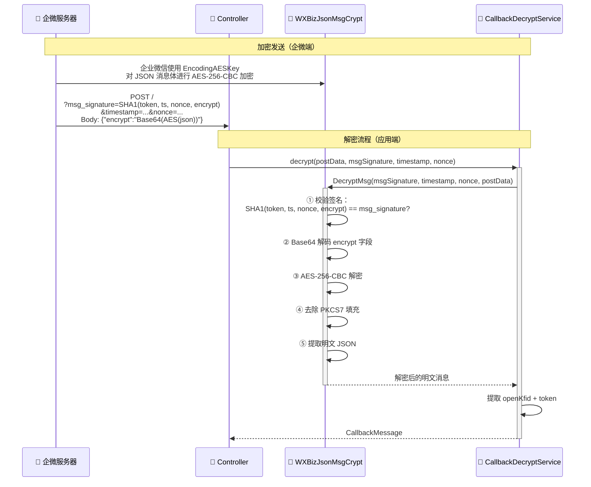
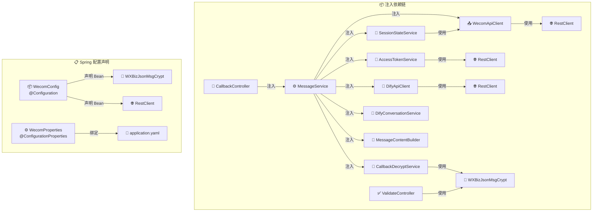

# WeCom 企微客服 AI 机器人 — 项目流程图

> **项目**：wecom-app  
> **路径**：`Backend/beckend/wecom-app`  
> **描述**：基于 Spring Boot 3.2 + Dify.ai 的企业微信智能客服机器人

---

## 1. 🏗️ 整体架构总览



---

## 2. 📂 项目结构树

```mermaid
graph TD
    ROOT["📁 wecom-app/"] --> POM["📄 pom.xml"]
    ROOT --> APP_YAML["⚙️ application.yaml"]

    ROOT --> CLIENT_PKG["client/"]
    CLIENT_PKG --> DifyClient["🧠 DifyApiClient.java"]
    CLIENT_PKG --> WecomClient["📤 WecomApiClient.java"]

    ROOT --> CONFIG_PKG["config/"]
    CONFIG_PKG --> Cfg_WecomConfig["📦 WecomConfig.java"]
    CONFIG_PKG --> Cfg_WecomProps["⚙️ WecomProperties.java"]

    ROOT --> CONST_PKG["constants/"]
    CONST_PKG --> Const_WecomConst["📌 WecomConstants.java"]

    ROOT --> CTRL_PKG["controller/"]
    CTRL_PKG --> Ctrl_Callback["📩 CallbackController.java"]
    CTRL_PKG --> Ctrl_Validate["✅ ValidateController.java"]

    ROOT --> DTO_PKG["dto/"]
    DTO_PKG --> DTO_AccessToken["🎫 AccessTokenResponse.java"]
    DTO_PKG --> DTO_CallbackMsg["📨 CallbackMessage.java"]
    DTO_PKG --> DTO_DifyReq["🤖 DifyChatRequest.java"]
    DTO_PKG --> DTO_DifyRsp["🤖 DifyChatResponse.java"]
    DTO_PKG --> DTO_SessionState["💬 GetSessionStateResponse.java"]
    DTO_PKG --> DTO_SendMsg["📤 SendMsgResponse.java"]
    DTO_PKG --> DTO_SessionReq["📋 SessionStateRequest.java"]
    DTO_PKG --> DTO_SyncMsg["📥 SyncMsgResponse.java"]
    DTO_PKG --> DTO_TransSession["🔄 TransSessionStateResponse.java"]
    DTO_PKG --> DTO_BaseRsp["📦 WecomBaseResponse.java"]

    ROOT --> SVC_PKG["service/"]
    SVC_PKG --> Svc_AccessToken["🎫 AccessTokenService.java"]
    SVC_PKG --> Svc_CallbackDecrypt["🔐 CallbackDecryptService.java"]
    SVC_PKG --> Svc_DifyConv["💭 DifyConversationService.java"]
    SVC_PKG --> Svc_MsgBuilder["📝 MessageContentBuilder.java"]
    SVC_PKG --> Svc_Message["📨 MessageService.java"]
    SVC_PKG --> Svc_SessionState["💬 SessionStateService.java"]

    ROOT --> CRYPTO_PKG["util/wx/mp/aes/"]
    CRYPTO_PKG --> Util_AesEx["⚠️ AesException.java"]
    CRYPTO_PKG --> Util_ByteGrp["📦 ByteGroup.java"]
    CRYPTO_PKG --> Util_JsonParse["📄 JsonParse.java"]
    CRYPTO_PKG --> Util_PKCS7["🔢 PKCS7Encoder.java"]
    CRYPTO_PKG --> Util_SHA1["🔏 SHA1.java"]
    CRYPTO_PKG --> Util_WXBiz["🔐 WXBizJsonMsgCrypt.java"]

    ROOT --> MAIN["🚀 WecomAppApplication.java"]
```



---

## 3. 📨 消息处理主流程（核心）



---

## 4. 🔄 会话状态机



---

## 5. 💭 Dify 多轮对话管理



---

## 6. 📊 消息类型处理矩阵



---

## 7. 🎫 Access Token 生命周期



---

## 8. 🔐 回调加解密流程



---

## 9. 🔗 组件依赖关系



---

## 10. 📅 启动与调用时序

```mermaid
timeline
    title 🚀 应用启动 → 处理第一条消息
    section 1️⃣ 启动阶段
        🚀 main : @SpringBootApplication + @EnableAsync
        📦 WecomConfig : 初始化 WXBizJsonMsgCrypt + RestClient
        ⚙️ WecomProperties : 绑定 wecom.* 配置项
        🎫 AccessTokenService : 就绪（懒加载）
    section 2️⃣ URL 验证阶段
        ✅ GET / : 企微验证回调 URL 有效性
        🔐 ValidateController : VerifyURL() 解密 echostr 并返回
    section 3️⃣ 消息处理阶段
        📩 POST / : 用户消息到达
        ⚙️ CallbackController : 异步调用 handleMessage()
        📨 MessageService : 解密 → 去重 → 拉消息 → AI 回复
